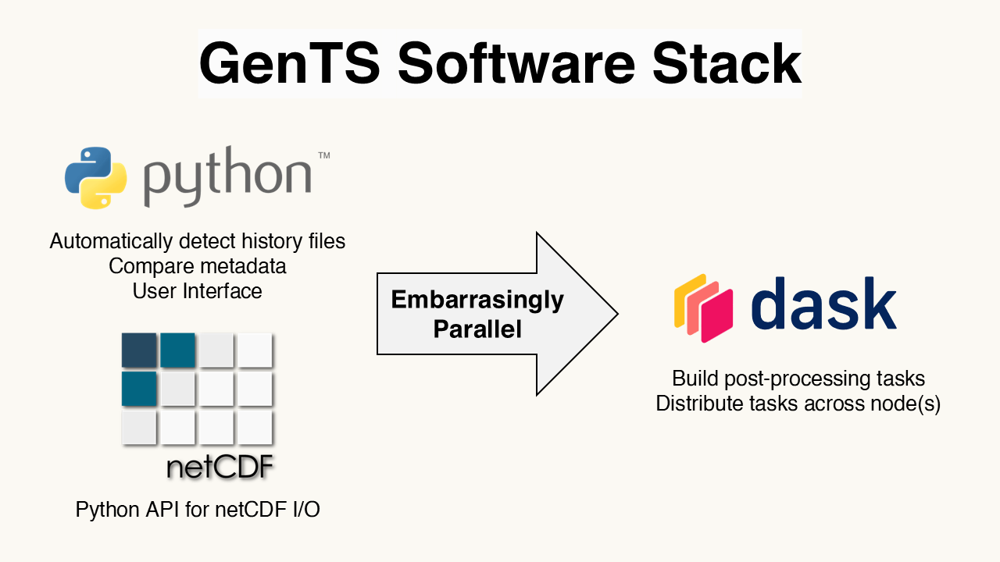
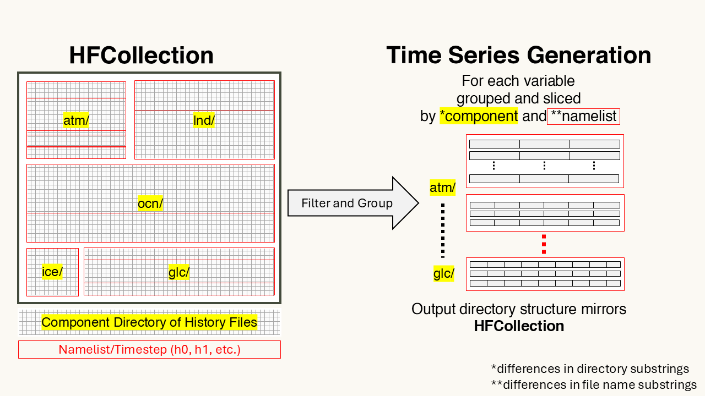

.. GenTS documentation master file, created by
   sphinx-quickstart on Thu Apr 24 12:54:03 2025.
   You can adapt this file completely to your liking, but it should at least
   contain the root `toctree` directive.

GenTS documentation
===================

Generate Time Series (GenTS) is an open-source Python library and tool for converting output from Earth System Models and Global Climate models in the "history file" format to the "time series" format. GenTS utilizes a simplified Python interface to make this common post-processing task as easy as possible and leverages Dask parallelism for optimal performance.

GenTS consolidates the conversion of history files to time series files into three steps:

#. Detect and read the metadata for all history files into a ``HFCollection`` 
#. Apply filters to include/exclude certain history files and then group them by model component (sub directory) and namelist (file name).
#. Generate an embarrasingly parallel workload that reads each variable across all of the history files within each of the formed groups, concatenate, and write them out as time series files.

Each of these steps requires the use of a Dask cluster, either created locally (using a LocalCluster) or connected to over a distributed system (such as PBS or SLURM using Dask-Jobqueue). This process is visualized below.

Note that after groups are created, the user can specify additional group settings such as slicing the timeseries into chunks of a specified length (10 years by default). All filtering and grouping functions are described in the User Guide (with more to come in the future).

.. toctree::
    install
    user
    api
