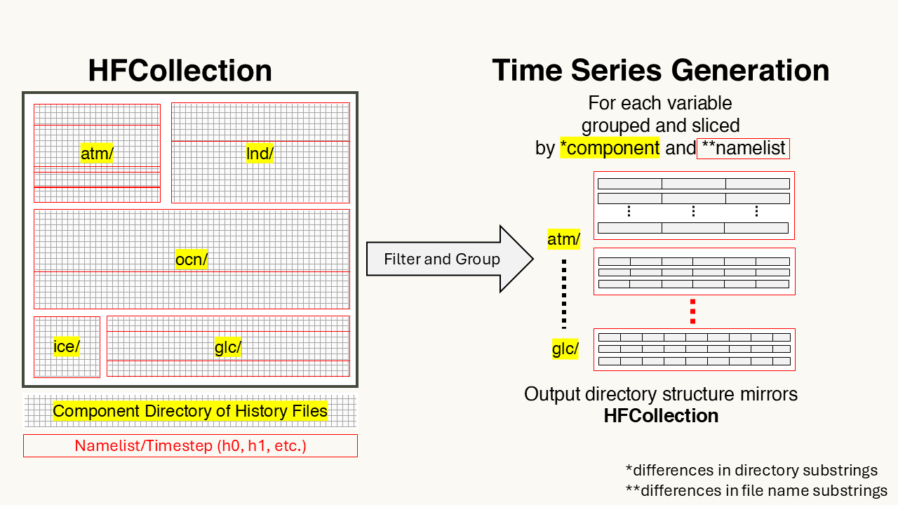

.. GenTS documentation master file, created by
   sphinx-quickstart on Thu Apr 24 12:54:03 2025.
   You can adapt this file completely to your liking, but it should at least
   contain the root `toctree` directive.

GenTS documentation
===================

Generate Time Series (GenTS) is an open-source Python library and tool for converting output from Earth System Models and Global Climate models in the "history file" format to the "time series" format. GenTS utilizes a simplified Python interface to make this common post-processing task as easy as possible and leverages parallelism for optimal performance.

GenTS consolidates the conversion of history files to time series files into four steps:

#. Detect and read the metadata for all history files into a ``HFCollection`` 
#. Apply filters to include/exclude certain history files and then group them by model component (sub directory) and namelist (file name).
#. Derive a ``TSCollection`` from the ``HFCollection`` and apply configurations/filters to obtain the desired time series files
#. Generate an embarrasingly parallel workload to write the time series files

These steps can be executed through a command-line interface (CLI) or via a Python script using the API. Model specific configurations for CESM3, CESM2, and E3SM are included in the CLI.

Note that the framework for GenTS is intended to be agnostic to the format of model output (making it more resilient to future model updates). Configurations for CESM, E3SM, and NorESM all use different implementations of the same GenTS API. Therefore, API functions in the core GenTS library are not model-specific. Instead, Python scripts that use GenTS functions are provided for each model under `gents/configs`. These scripts are then called by the CLI.

.. toctree::
    install
    user
    dev
    api
